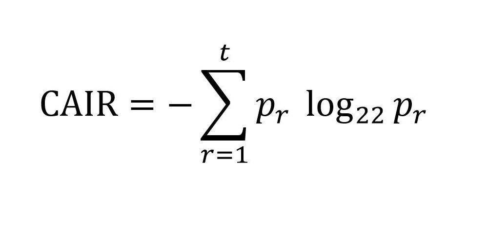
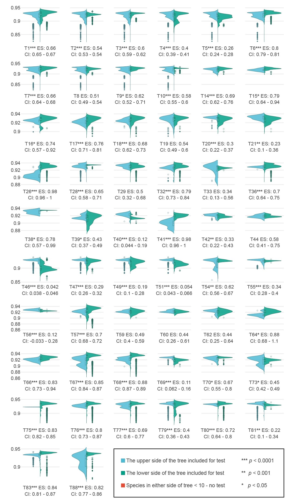
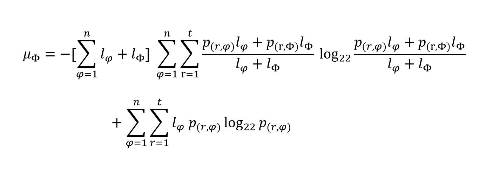
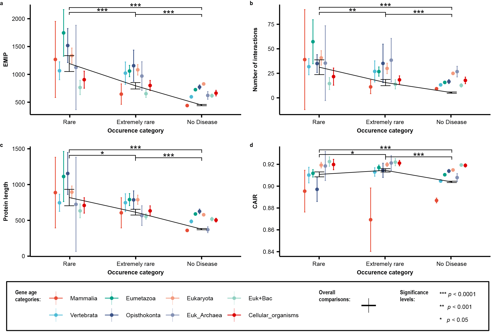

An extension of Shannon’s entropy agrees with the tree of life and justifies human disease occurrences
=====================================

<p align="center">
  
</p>

[Website](https://www.synaptic.one/) |
[Reproducibility](https://github.com/synaptic-proteolab/CAIR_EMIP/tree/master/README.md#Usage) |
[Tutorial on Toy Data](https://github.com/synaptic-proteolab/CAIR_EMIP/tree/master/README.md#Toy-data) |
[Reference article]() |
[Supplementary materials](https://github.com/synaptic-proteolab/CAIR_EMIP/tree/master/Supplementary_materials)

[](http://hits.dwyl.com/synaptic-proteolab/CAIR_EMIP)
[](https://github.com/synaptic-proteolab/CAIR_EMIP/pulls)
[](https://github.com/synaptic-proteolab/CAIR_EMIP/issues)
[](https://opensource.org/licenses/MIT)
 

# Description
<p align="justify">In this study, with the use of the information theory, we have proposed and proved a mathematical theorem by which we argue the reason for the existence of human diseases. To introduce our theoretical frame of reference, first, we present Shannon’s entropy for proteomes as a tool to compare systems complexity and distinguish between the several levels of biological organizations. Nearly 180 million proteins with more than 61 billion amino acids are analyzed to classify ~29 thousand organisms in 92 phyla. We further establish a new approach, namely the wave of life, to differentiate several taxa and corroborate our findings through the latest tree of life. Foremost, Homo sapiens data from UniProt, PICKLE, and Orphanet databases are gathered and analyzed according to our new theorem to show that disease occurrences follow our predictions. Furthermore, we discuss the dynamics of protein network stability and the different possible scenarios for the existence of human diseases. We also account for the reasoning behind our mathematical theorem and its biological inferences. This GitHub repository involves the Python and R implementation of the investigation. </p>


# Table of contents
* [Quick links to main codes](https://github.com/synaptic-proteolab/CAIR_EMIP/tree/master/README.md#Quick-links-to-main-codes)
* [The Calculated Average Information per Residue (CAIR)](https://github.com/synaptic-proteolab/CAIR_EMIP/tree/master/README.md#CAIR-algorithm)  
* [CAIR comparisons through the tree of life](https://github.com/synaptic-proteolab/CAIR_EMIP/tree/master/README.md#CAIR-comparisons-through-the-tree-of-life)  
* [The Mutual Information of Proteins (EMIP)](https://github.com/synaptic-proteolab/CAIR_EMIP/tree/master/README.md#The-Mutual-Information-of-Proteins-(EMIP))  
* [Analysis of human disease indicators](https://github.com/synaptic-proteolab/CAIR_EMIP/tree/master/README.md#Analysis-of-human-disease-indicators)  
* [Usage](https://github.com/synaptic-proteolab/CAIR_EMIP/tree/master/README.md#Usage)  
* [Toy data](https://github.com/synaptic-proteolab/CAIR_EMIP/tree/master/README.md#Toy-data)  


# Quick links to main codes 

* **runCAIR** (Calculating CAIRs for all available proteomes)  
_Prepared manuscript_  
Python codes: [runCAIR](https://github.com/synaptic-proteolab/CAIR_EMIP/tree/master/ShannoProt/runCAIR).  
* **CAIRcomp** (Proteome CAIR comparisons through the tree of life)  
_Prepared manuscript_  
R codes: [CAIR Comparisons](https://github.com/synaptic-proteolab/CAIR_EMIP/tree/master/R_codes/CAIR_comparisons).  
* **runEMIP** (Human disease category indicators -- EMIP, etc.)  
_Prepared manuscript_  
Python codes: [runEMIP](https://github.com/synaptic-proteolab/CAIR_EMIP/tree/master/ShannoProt/runEMIP).  
* **DiseaseAnals** (Investigation on probable associations between disease occurrences and disease indicators in human proteome)  
_Prepared manuscript_  
R codes: [DiseaseAnals](https://github.com/synaptic-proteolab/CAIR_EMIP/tree/master/R_codes/EMIP_analyses).

# The CAIR of each protein
[](https://colab.research.google.com/github/synaptic-proteolab/CAIR_EMIP/tree/master/ShannoProt/runCAIR/runCAIR.ipynb)

In the context of proteomics, the CAIR is proposed as the 22-ary of [Shannon’s entropy](https://en.wikipedia.org/wiki/Entropy_(information_theory)). For each given protein, CAIR is formulized as:  
   
in which r is a numeral given to each residue, t is the total number of residues, p_r is the relative frequency of rth residue in the protein.

# CAIR comparisons through the tree of life
<p align="justify">After running the <a href="https://github.com/synaptic-proteolab/CAIR_EMIP/tree/master/R_codes/CAIR_comparisons/CAIR%20comparison%20violin%20plots/Violin%20Plots.R">R code</a> for comparison of phyla CAIRs all through the tree of life, the below figure would be obtained. The significance test is the <a href="https://www.sciencedirect.com/science/article/abs/pii/S0167947306001885">Brunner-Munzel test</a> (or known as Generalized Wilcoxon test) as the phyla CAIRs are negatively-skewed, unbalanced and heteroscedastic.</p>
 

# The Mutual Information of Proteins (EMIP)
[](https://colab.research.google.com/github/synaptic-proteolab/CAIR_EMIP/tree/master/ShannoProt/runEMIP/Human_disease_category_indicators.ipynb)

As proposed by the mathematical theorem, the estimation of mutual information is formulized as:  
   
<p align="justify">in which μ_Φ is the mutual information for the Φ protein, n is the number of interactions, l_φ is the length of the φth interactor, l_Φ is the length of protein Φ, r is a numeral given to each residue in proteins, t is the total number of residues, p_((r,φ)) is the relative frequency of rth residue in φth interactor, and p_((r,Φ)) is the relative frequency of rth residue in Φ protein.</p>

# Analysis of human disease indicators
<p align="justify">After running the <a href="https://github.com/synaptic-proteolab/CAIR_EMIP/tree/master/R_codes/EMIP_analyses/Human%20proteome%20analysis/DTK%20test%20%26%20Errorbars.R">R code</a> for comparison of phyla CAIRs all through the tree of life, the below figure would be obtained. The significance test is the Dunnett-Tukey-Kramer pairwise multiple comparison test adjusted for unequal variances and unequal sample sizes.</p>
 


# Usage

## Prerequisites

All required packages to run the scripts can be installed from Terminal/CMD using:
```sh
pip3 install requests biopython numpy pandas import_ipynb
```
## 1. CAIR Project
### Input files>
Required files to run runCAIR.py are available at:

* [uniprot_sprot.fasta](https://ftp.expasy.org/databases/uniprot/current_release/knowledgebase/complete/uniprot_sprot.fasta.gz) 

* [uniprot_trembl.fasta](https://ftp.expasy.org/databases/uniprot/current_release/knowledgebase/complete/uniprot_trembl.fasta.gz) (For downloading this file, the FTP link is highly recommended due to its massive size of ~100GB)

* [proteomes-redundant-no.tab](https://www.uniprot.org/proteomes/?query=redundant:no&format=tab&force=true&columns=id,name,organism-id,lineage&compress=yes)  

  ###### *Downloaded files should be moved to the CAIR project directory

#### Run from Terminal/CMD
runCAIR can be executed directly from the Terminal/CMD by following all the instructions explained in the [ToyData](#ToyData) section, except for the line: 
```
cd ShannoProt/ToyData/runCAIR
```
which should be changed to (~~/ToyData~~):
```
cd ShannoProt/runCAIR
```
#### Run from Python
Fire up your IPython notebook.  
Open "runCAIR.ipynb" and run all cells.

### Final output files>
* 1. [Complete proteome CAIRs.csv](https://github.com/synaptic-proteolab/CAIR_EMIP/tree/master/Supplementary_materials/CAIR_supplementary_files/Complete_proteome_CAIRs.csv)
* 2. [All species residues.csv (*not uploaded due to its large size)]()
* 3. [Entries sprot.csv (*not uploaded due to its large size)]()
* 4. [Entries trembl (*not uploaded due to its large size)]()

## 2. EMIP Project
### Input files>
Required files to run runEMIP.py are available at:

* [UniProtNormalizedTabular-default.txt](www.pickle.gr/Data/2.5/PICKLE2_5_UniProtNormalizedTabular-default.zip)
* [uniprot-proteome%3AUP000005640.tab](https://www.uniprot.org/uniprot/?query=proteome:UP000005640&format=tab&force=true&columns=id,reviewed,genes(PREFERRED),protein%20names,sequence,database(Orphanet),comment(INVOLVEMENT%20IN%20DISEASE),interactor&compress=yes)
* [en_product9_prev.csv](http://www.orphadata.org/data/xml/en_product9_prev.xml) (***the file should firstly be converted from .xml to .csv via Microsoft Excel or a similar program***)
* [main_HUMAN.csv](https://github.com/marcottelab/Gene-Ages/raw/master/Main/main_HUMAN.csv)  

  ###### *NOTE: Downloaded files should be moved to the EMIP project directory.

#### Run from Terminal/CMD
runEMIP can be executed directly from the Terminal/CMD by following all the instructions explained in the [ToyData](#ToyData) section, except for the line: 
```
cd ShannoProt/ToyData/runEMIP
```
which should be changed to (~~/ToyData~~):
```
cd ShannoProt/runEMIP
```
#### Run from Python
Fire up your IPython notebook.  
Open "Human_disease_category_indicators.ipynb" and run all cells.

### Final output files>
* 1. [w%entries(dropped)_w%diseases(expanded)_w%uniprot_w%orpha(processed).csv](https://github.com/synaptic-proteolab/CAIR_EMIP/tree/master/Supplementary_materials/EMIP_supplementary_files/w%entries(dropped)_w%diseases(expanded)_w%uniprot_w%orpha(processed).csv)
* 2. [w%entries_w%diseases(accumulated)_w%uniprot_w%orpha(processed).csv](https://github.com/synaptic-proteolab/CAIR_EMIP/tree/master/Supplementary_materials/EMIP_supplementary_files/w%entries_w%diseases(accumulated)_w%uniprot_w%orpha(processed).csv)
* 3. [w%entries_w%diseases(expanded)_w%uniprot_w%orpha(unprocessed).csv](https://github.com/synaptic-proteolab/CAIR_EMIP/tree/master/Supplementary_materials/EMIP_supplementary_files/w%entries_w%diseases(expanded)_w%uniprot_w%orpha(unprocessed).xlsx)
* 4. [w%entries_w%diseases_w%uniprot_wo%orpha.csv](https://github.com/synaptic-proteolab/CAIR_EMIP/tree/master/Supplementary_materials/EMIP_supplementary_files/w%entries_w%diseases_w%uniprot_wo%orpha.csv)

# Toy data
<p align="justify">Toy data contains an exemplary protein data for users to get to use runCAIR and runEMIP Python functions. It is to be noted that the data are small subsets of real proteome data and human diseases datasets. The toy data helps users test and work on codes without the need of dealing with large data.</p>

<p align="justify">For instance, CAIRs for 16 organisms mentioned in Supplemetary Table 1 of the article can be eaisly reproduced using toy data. The required files are available in <a href="https://github.com/synaptic-proteolab/CAIR_EMIP/tree/master/ShannoProt/ToyData">ToyData folder</a>. In this code, The program will count all the residues in ToyData FASTA files, group them by organism IDs and calculate CAIRs for each complete protome.</p>

<p align="justify">Nevertheless, in case users desire to run the complete algorithms, they could download <a href="https://github.com/synaptic-proteolab/CAIR_EMIP/tree/master/README.md##-1.-CAIR-Project">all required files</a> (~100GB for CAIR + ~100MB for EMIP).</p>


## Prerequisites

All required packages to run the following scripts can be installed from terminal/CMD using:
```sh
pip3 install requests biopython numpy pandas import_ipynb
```

## 1. CAIR Project

### Run from:

#### Windows

1. Clone the repo:
```
git clone https://github.com/synaptic-proteolab/CAIR_EMIP.git
```
2. Change running directory to the project environment:
```
cd %HOMEDRIVE%%HOMEPATH%
cd ShannoProt/ToyData/runCAIR
```
3. Run the code file:
```py
python runCAIR.py
or
python3 runCAIR.py
```
#### Linux
1. Clone the repo:
```sh
git clone https://github.com/synaptic-proteolab/CAIR_EMIP.git
``` 
2. Change running directory to the project environment:
```sh
cd ~
cd ShannoProt/ToyData/runCAIR
```
3. Run the code file:
```sh
python runCAIR.py
or
python3 runCAIR.py
```
## 2. EMIP Project

### Run from:

#### Windows

1. Clone the repo:
```
git clone https://github.com/synaptic-proteolab/CAIR_EMIP.git
```

2. Change running directory to the project environment:
```
cd %HOMEDRIVE%%HOMEPATH%
cd ShannoProt/ToyData/runEMIP
```
3. Run the code file:
```py
python Human_disease_category_indicators.py
or
python3 Human_disease_category_indicators.py
```
#### Linux
1. Clone the repo:
```sh
git clone https://github.com/synaptic-proteolab/CAIR_EMIP.git
``` 

2. Change running directory to the project environment:
```sh
cd ~
cd ShannoProt/ToyData/runEMIP
```
3. Run the code file:
```sh
python Human_disease_category_indicators.py
or
python3 Human_disease_category_indicators.py
```

Reference Paper
-------
Not published yet

License
-------
© Copyright 2020 Synaptic Proteolab. Licensed under the MIT License. See [LICENSE](https://github.com/synaptic-proteolab/CAIR_EMIP/tree/master/LICENSE) file for more details.


